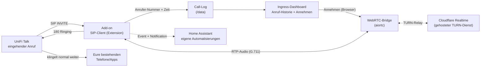

# UniFi Talk Softphone

**Anrufe annehmen & wählen, Anrufer-Übersicht & SIP-Client für UniFi Talk in Home Assistant**

UniFi Talk bietet in Deutschland offiziell keinen Softphone-Modus (Telefonieren über
PC/Handy-App) und keine API/Webhooks für Anruf-Ereignisse. Dieses Home-Assistant-Add-on
registriert sich per SIP als zusätzliche Extension bei UniFi Talk und lässt sich direkt
im Home-Assistant-Dashboard als echtes Softphone nutzen — eingehende Anrufe annehmen und
interne Extensions selbst wählen, mit echtem Audio über eine WebRTC-Brücke im Browser
(auch in der Home-Assistant-App, solange Home Assistant über HTTPS erreichbar ist).

***

## So funktioniert's



Das Add-on nimmt Anrufe nicht automatisch an — es klingelt zusätzlich zu euren
bestehenden Geräten/der App mit und lässt sich bei Bedarf im Dashboard übernehmen; reagiert
niemand, greift nach kurzer Zeit das konfigurierte Standardverhalten (loggen oder ablehnen).

***

## Funktionen

* SIP-Registrierung (Digest-Auth) als zusätzliche Extension bei UniFi Talk
* Erkennung eingehender Anrufe inkl. Anrufer-Nummer und Anzeigename
* **Anrufe im Dashboard annehmen UND interne Extensions selbst wählen** — per
  Mikrofon/Lautsprecher des Browsers (WebRTC-Brücke; für Zugriff auch von
  unterwegs nutzt sie Cloudflares gehosteten TURN-Dienst — kein eigener
  Server, keine Portfreigabe am Router nötig); funktioniert auch in der
  Home-Assistant-App, sofern über HTTPS aufgerufen
* Ingress-Dashboard in der Home-Assistant-Seitenleiste: Registrierungsstatus,
  Live-Anruf-Banner mit Annehmen/Ablehnen/Auflegen, Wählfeld, Anruf-Historie,
  eingebettete Setup-Anleitung
* Home-Assistant-Benachrichtigung bei eingehendem Anruf (`notify_on_call`) — als
  `persistent_notification` sowie als Event `unifi_talk_incoming_call` für eigene
  Automatisierungen (z. B. Ansage auf einem Lautsprecher oder Push aufs Handy)
* Konfigurierbares Standard-Anruf-Verhalten (`call_handling`), falls niemand annimmt:
  nur loggen oder aktiv ablehnen
* Keine sensiblen Daten im Code — alle Zugangsdaten werden lokal in Home Assistant
  eingegeben

## Was dieses Add-on (noch) nicht kann

**Externe Rufnummern (normale Telefonanschlüsse) lassen sich nicht anrufen** —
UniFi Talk routet externe Ziele nachweislich nur über eine interne
Anwendungslogik, nicht über ein regulär per SIP-INVITE erreichbares
Dialplan-Ziel. Interne Extensions/andere Third-Party-Geräte lassen sich
zuverlässig anrufen. Außerdem immer nur **ein Anruf gleichzeitig** (angenommen
oder gewählt). Telefonie von unterwegs (außerhalb des LAN) braucht zusätzlich
einen kostenlosen/günstigen Cloudflare-TURN-Key (`cf_turn_key_id`/
`cf_turn_api_token`, siehe DOCS.md) — ohne das funktioniert Annehmen/Wählen nur
im selben WLAN/LAN wie der Add-on-Host.

***

## Voraussetzungen

* Eine UniFi-OS-Console mit UniFi Talk (UDM-Pro, UDM-SE, Cloud Gateway o. ä.)
* SSH-Zugriff auf die Console (nur einmalig für die Einrichtung nötig)
* Eine per SIP-Extension-Workaround erzeugte Zugangsdaten (Host, Extension, Passwort)
  — siehe **geführte Setup-Anleitung** im Dokumentations-Tab des Add-ons
  ([unifi-talk-softphone/DOCS.md](unifi-talk-softphone/DOCS.md)) bzw. direkt im
  Ingress-Dashboard

> Dieser Weg ist ein von der Community entdeckter, **inoffizieller Workaround** und
> wird von Ubiquiti nicht offiziell unterstützt — er kann mit einem Firmware-Update
> jederzeit brechen.

***

## Installation

1. In Home Assistant zu **Einstellungen → Add-ons → Add-on Store** wechseln
2. Oben rechts auf die drei Punkte → **Repositories** klicken und folgende URL
   hinzufügen:

       https://github.com/martin141089/unifi-talk-softphone

3. Das Add-on **„UniFi Talk Softphone"** in der Liste suchen und **installieren**
4. Add-on **noch nicht starten** — zuerst die geführte Setup-Anleitung
   ([DOCS.md](unifi-talk-softphone/DOCS.md)) durchgehen, um SIP-Host, Extension und
   Passwort zu ermitteln
5. Konfiguration öffnen, die ermittelten Werte eintragen, speichern
6. Add-on **starten**
7. Im Dashboard (Home-Assistant-Seitenleiste) den Registrierungsstatus prüfen

## Konfiguration (`config.yaml`)

```yaml
options:
  talk_sip_host: ""
  talk_sip_port: 5060
  sip_extension: ""
  sip_password: ""
  sip_domain: "talk.com"
  local_sip_port: 5070
  call_handling: "log_only"
  notify_on_call: true
  register_expiry: 300

  enable_calling: true
  cf_turn_key_id: ""
  cf_turn_api_token: ""
```

| Option              | Beschreibung                                                                 |
| -------------------- | ----------------------------------------------------------------------------- |
| `talk_sip_host`      | Management-IP eurer UniFi-Console                                            |
| `talk_sip_port`      | SIP-Port der Console (Standard `5060`)                                       |
| `sip_extension`      | Extension aus dem Setup-Workaround (z. B. `0007`)                            |
| `sip_password`       | Zugehöriges SIP-Passwort (per SSH ausgelesen, siehe DOCS.md)                 |
| `sip_domain`         | SIP-Domain/Realm (Standard `talk.com`)                                        |
| `local_sip_port`     | Lokaler UDP-Port des Add-ons für SIP-Signaling                               |
| `call_handling`      | Standardverhalten, falls niemand annimmt: `log_only` (nur loggen) oder `decline` (ablehnen) |
| `notify_on_call`     | Home-Assistant-Benachrichtigung bei eingehendem Anruf (Standard `true`)      |
| `register_expiry`    | SIP-Registrierungs-Intervall in Sekunden (Standard `300`)                    |
| `enable_calling`     | Annehmen/Wählen mit Audio im Dashboard aktivieren (Standard `true`)          |
| `cf_turn_key_id`     | Token-ID des Cloudflare-Realtime-TURN-Keys (leer = Annehmen nur im LAN)      |
| `cf_turn_api_token`  | Zugehöriges API-Token aus dem Cloudflare Dashboard                          |

### Automatisierung über das Event `unifi_talk_incoming_call`

```yaml
automation:
  - alias: "UniFi Talk Anruf → Push"
    trigger:
      - platform: event
        event_type: unifi_talk_incoming_call
    action:
      - service: notify.mobile_app_dein_handy
        data:
          title: "Anruf"
          message: "{{ trigger.event.data.name or trigger.event.data.number }}"
```

***

## Lizenz

MIT, siehe [LICENSE](LICENSE).
