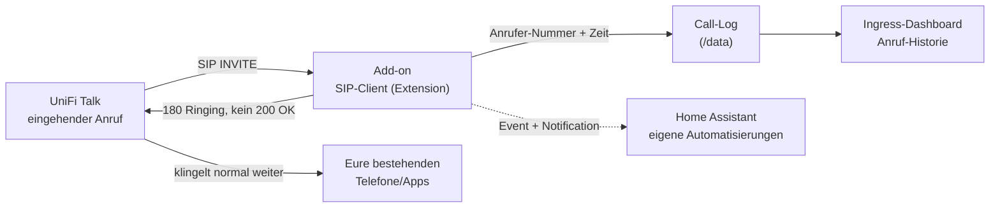

# UniFi Talk Softphone

**Anrufer-Übersicht & SIP-Client für UniFi Talk in Home Assistant**

UniFi Talk bietet in Deutschland offiziell keinen Softphone-Modus (Telefonieren über
PC/Handy-App) und keine API/Webhooks für Anruf-Ereignisse. Dieses Home-Assistant-Add-on
registriert sich per SIP als zusätzliche, passive Extension bei UniFi Talk und erkennt
so eingehende Anrufe (Anrufer-Nummer, Zeitpunkt) — als Anrufer-Übersicht im
Home-Assistant-Dashboard und als Event/Notification für eigene Automatisierungen.

***

## So funktioniert's



Das Add-on nimmt Anrufe standardmäßig **nicht an** — es registriert sich nur zusätzlich
zu euren bestehenden Geräten/der App und beobachtet eingehende Anrufe passiv.

***

## Funktionen

* SIP-Registrierung (Digest-Auth) als zusätzliche, passive Extension bei UniFi Talk
* Erkennung eingehender Anrufe inkl. Anrufer-Nummer und Anzeigename
* Ingress-Dashboard in der Home-Assistant-Seitenleiste: Registrierungsstatus,
  Anruf-Historie, eingebettete Setup-Anleitung
* Home-Assistant-Benachrichtigung bei eingehendem Anruf (`notify_on_call`) — als
  `persistent_notification` sowie als Event `unifi_talk_incoming_call` für eigene
  Automatisierungen (z. B. Ansage auf einem Lautsprecher oder Push aufs Handy)
* Konfigurierbares Anruf-Verhalten (`call_handling`): nur loggen oder aktiv ablehnen
* Keine sensiblen Daten im Code — alle Zugangsdaten werden lokal in Home Assistant
  eingegeben

## Was dieses Add-on (noch) nicht kann

Es ist eine reine **Anruf-Erkennung**, kein Softphone mit Audio: Es führt/beantwortet
keine Gespräche. Echtes Telefonieren am PC/Handy über Home Assistant wäre ein
möglicher nächster Ausbauschritt (z. B. über eine WebRTC-Bridge), aber (noch) nicht
Teil dieser ersten Version.

***

## Voraussetzungen

* Eine UniFi-OS-Console mit UniFi Talk (UDM-Pro, UDM-SE, Cloud Gateway o. ä.)
* SSH-Zugriff auf die Console (nur einmalig für die Einrichtung nötig)
* Eine per SIP-Extension-Workaround erzeugte Zugangsdaten (Host, Extension, Passwort)
  — siehe **geführte Setup-Anleitung** im Dokumentations-Tab des Add-ons
  ([unifi-talk-softphone/DOCS.md](unifi-talk-softphone/DOCS.md)) bzw. direkt im
  Ingress-Dashboard

> Dieser Weg ist ein von der Community entdeckter, **inoffizieller Workaround** und
> wird von Ubiquiti nicht offiziell unterstützt — er kann mit einem Firmware-Update
> jederzeit brechen.

***

## Installation

1. In Home Assistant zu **Einstellungen → Add-ons → Add-on Store** wechseln
2. Oben rechts auf die drei Punkte → **Repositories** klicken und folgende URL
   hinzufügen:

       https://github.com/martin141089/unifi-talk-softphone

3. Das Add-on **„UniFi Talk Softphone"** in der Liste suchen und **installieren**
4. Add-on **noch nicht starten** — zuerst die geführte Setup-Anleitung
   ([DOCS.md](unifi-talk-softphone/DOCS.md)) durchgehen, um SIP-Host, Extension und
   Passwort zu ermitteln
5. Konfiguration öffnen, die ermittelten Werte eintragen, speichern
6. Add-on **starten**
7. Im Dashboard (Home-Assistant-Seitenleiste) den Registrierungsstatus prüfen

## Konfiguration (`config.yaml`)

```yaml
options:
  talk_sip_host: ""
  talk_sip_port: 5060
  sip_extension: ""
  sip_password: ""
  sip_domain: "talk.com"
  local_sip_port: 5070
  call_handling: "log_only"
  notify_on_call: true
  register_expiry: 300
```

| Option              | Beschreibung                                                                 |
| -------------------- | ----------------------------------------------------------------------------- |
| `talk_sip_host`      | Management-IP eurer UniFi-Console                                            |
| `talk_sip_port`      | SIP-Port der Console (Standard `5060`)                                       |
| `sip_extension`      | Extension aus dem Setup-Workaround (z. B. `0007`)                            |
| `sip_password`       | Zugehöriges SIP-Passwort (per SSH ausgelesen, siehe DOCS.md)                 |
| `sip_domain`         | SIP-Domain/Realm (Standard `talk.com`)                                        |
| `local_sip_port`     | Lokaler UDP-Port des Add-ons für SIP-Signaling                               |
| `call_handling`      | `log_only` (nur loggen) oder `decline` (Anruf nach dem Loggen ablehnen)       |
| `notify_on_call`     | Home-Assistant-Benachrichtigung bei eingehendem Anruf (Standard `true`)      |
| `register_expiry`    | SIP-Registrierungs-Intervall in Sekunden (Standard `300`)                    |

### Automatisierung über das Event `unifi_talk_incoming_call`

```yaml
automation:
  - alias: "UniFi Talk Anruf → Push"
    trigger:
      - platform: event
        event_type: unifi_talk_incoming_call
    action:
      - service: notify.mobile_app_dein_handy
        data:
          title: "Anruf"
          message: "{{ trigger.event.data.name or trigger.event.data.number }}"
```

***

## Lizenz

MIT, siehe [LICENSE](LICENSE).
